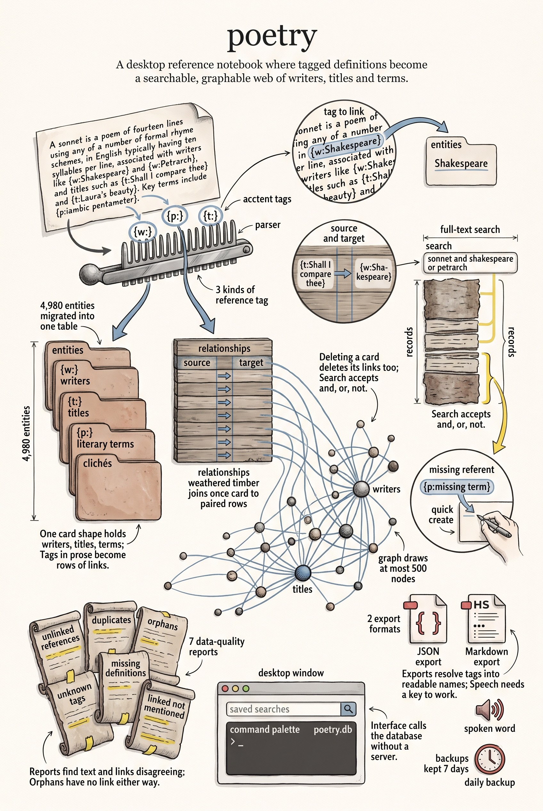

# Poetry DB

A desktop application for managing literary references, definitions, and relationships built with Wails, Go, and React.


## Architectural Status

`poetry` is an active app and is expected to move toward the newer shared-app
platform over time. It is not the default template for new desktop-app work
today, but it is also not intended to remain a permanent architectural outlier.

That means:

- the app is still supported and worth maintaining
- its current custom frontend shell and app-local `UIContext` pattern should be
  treated as transitional rather than final
- newer platform guidance for new apps should generally follow `works`,
  `acrylic`, and `siteman` instead

Current modernization direction:

- align docs and platform guidance with the actual app code
- move the frontend shell toward shared platform primitives where they fit
- reduce app-local patterns when the shared packages already provide a clearer
  replacement
- standardize repo-level build, lint, type-check, and test entry points

## Features

### Core Functionality
- **Entity Management**: Create and manage References, Writers, Titles, and other entity types (names, clichés, literary terms) from a single generic `entities` model
- **Full-Text Search**: Powered by SQLite FTS5 with Boolean operators (AND, OR, NOT), regex support, and advanced filters
- **Reference Linking**: Automatic parsing and linking of `{w: word}`, `{p: person}`, and `{t: title}` references in definitions
- **Real-Time Validation**: Live validation of references as you type with quick-create for missing items
- **Interactive Graph**: Visualize relationships between items with filtering by type and connection count
- **Text-to-Speech**: Pronunciation support using OpenAI TTS API with intelligent caching
- **Optional Capabilities**: Text-to-speech, image generation, and AI features are reported by `GetCapabilities()` and enable themselves only when the matching API keys are present

### Data Quality & Reports
- Unlinked references detection
- Duplicate item detection
- Orphaned items (no connections)
- Missing definitions report
- Unknown tags and types analysis
- Items linked but not mentioned in definitions

### Export & Backup
- **JSON Export**: Complete structured data with all metadata and relationships
- **Markdown Export**: Human-readable format with resolved references and table of contents
- **Export Both**: Simultaneous export in both formats
- **Automated Backups**: Daily backups with 7-day rotation
- **Manual Backup/Restore**: On-demand database snapshots

### User Experience
- **Keyboard Shortcuts**: Fast navigation with `/` (search), `n` (new item), `g` (graph), `h` (home), `Esc` (back)
- **Command Palette**: Quick access to all features with `Cmd/Ctrl+K`
- **Dark Mode**: Automatic system theme detection
- **Window Persistence**: Remembers window size and position
- **Recent Searches**: Quick access to previous search queries
- **Saved Searches**: Store frequently used search filters

## Setup

### Prerequisites

- **Go 1.23+**: [Download Go](https://go.dev/dl/)
- **Node.js 18+**: [Download Node.js](https://nodejs.org/)
- **Wails CLI v2.10.2**: `go install github.com/wailsapp/wails/v2/cmd/wails@latest`

### Environment Variables

1. Copy the example environment file:
   ```bash
   cp .env.example .env
   ```

2. Edit `.env` and add your API keys:
   ```bash
   # Required for text-to-speech functionality (optional)
   OPENAI_API_KEY=sk-your-actual-key-here  # credentials-scanner: ignore-line — documentation placeholder
   ```

3. Get an OpenAI API key at: <https://platform.openai.com/api-keys>

**Note**: The `.env` file contains sensitive data and is excluded from version control.

### Database Setup

The application uses SQLite with FTS5 (Full-Text Search) support. On first launch, it will:
- Create a database in the platform data directory (for example, `~/.local/share/trueblocks/poetry/poetry.db`)
- Initialize tables, indexes, and FTS search structures
- Set up automated daily backups

The resolved database path is available from `GetDatabasePath()` and shown in Settings.

To change where exports are written:
1. Open Settings
2. Select the export folder picker
3. Choose your preferred location (an `exports` subfolder is appended automatically if the chosen folder isn't already named `exports`)

## Development

### Live Development

To run in live development mode:

```bash
wails dev
```

This will:
- Start a Vite development server with hot module reload
- Launch the desktop application
- Expose a dev server at <http://localhost:34115> for browser-based development

### Testing

```bash
# Run all tests (Go + Frontend)
yarn test

# Run Go backend tests only
yarn test-go

# Run frontend tests only
yarn test-tsx

# Run with coverage
cd frontend && yarn test --coverage
```

### Linting

```bash
# Lint both Go and TypeScript
yarn lint

# Lint Go only
cd backend && go vet ./...

# Lint TypeScript only
cd frontend && yarn lint
```

### Building

To build a production package with SQLite FTS5 support:

```bash
wails build -tags fts5
```

**Important**: Always include `-tags fts5` to enable full-text search functionality.

The built application will be in `build/bin/`.

## Architecture

### Technology Stack
- **Backend**: Go with Wails framework for native API bridge
- **Frontend**: React with TypeScript, Mantine UI components
- **Database**: SQLite with FTS5 full-text search over a generic `entities` / `relationships` schema
- **Graph**: D3.js force simulation with React Flow
- **State Management**: TanStack Query for async data, plus app-local React Context via `UIContext`
- **API**: Direct CGO bridge (no HTTP/REST overhead)

### Project Structure
```
poetry/
├── app.go                 # Main application logic, API handlers
├── main.go               # Entry point
├── backend/
│   ├── components/       # Ad-hoc query component
│   ├── config/           # app_config.json loading (entity types, views)
│   ├── database/         # Database layer with SQLite operations
│   ├── services/         # Entity, image, and TTS services
│   └── settings/         # Settings persistence
├── cmd/
│   └── migrate_data/     # Legacy schema → entity/relationship migration tool
├── frontend/
│   ├── src/
│   │   ├── pages/       # Main application pages
│   │   ├── components/  # Reusable UI components
│   │   ├── hooks/       # Custom React hooks
│   │   ├── types/       # Entity type definitions
│   │   └── utils/       # Shared utilities
│   └── wailsjs/         # Auto-generated TypeScript bindings
├── schema.sql           # Database schema with indexes and views
└── wails.json          # Wails configuration
```

### Key Patterns
- **Direct CGO Bridge**: Frontend calls Go functions directly (no REST API)
- **Type Safety**: Auto-generated TypeScript types from Go structs
- **Generic Entity Model**: Content lives in `entities` (with JSON attributes) and `relationships`, driven by `app_config.json`
- **Reference System**: `{w:}, {p:}, {t:}` tags for semantic linking
- **Optimistic Updates**: UI updates immediately with background sync
- **Streaming Data**: Progressive loading for large datasets

## Documentation

- [CONTRIBUTING.md](CONTRIBUTING.md) - Development guidelines and workflow
- [ARCHITECTURE.md](ARCHITECTURE.md) - Detailed technical architecture
- [API.md](API.md) - Go backend API reference
- [MIGRATION_PLAN.md](MIGRATION_PLAN.md) - Generic entity architecture migration record
- [TROUBLESHOOTING.md](TROUBLESHOOTING.md) - Common issues and solutions

## License

See LICENSE file for details.


