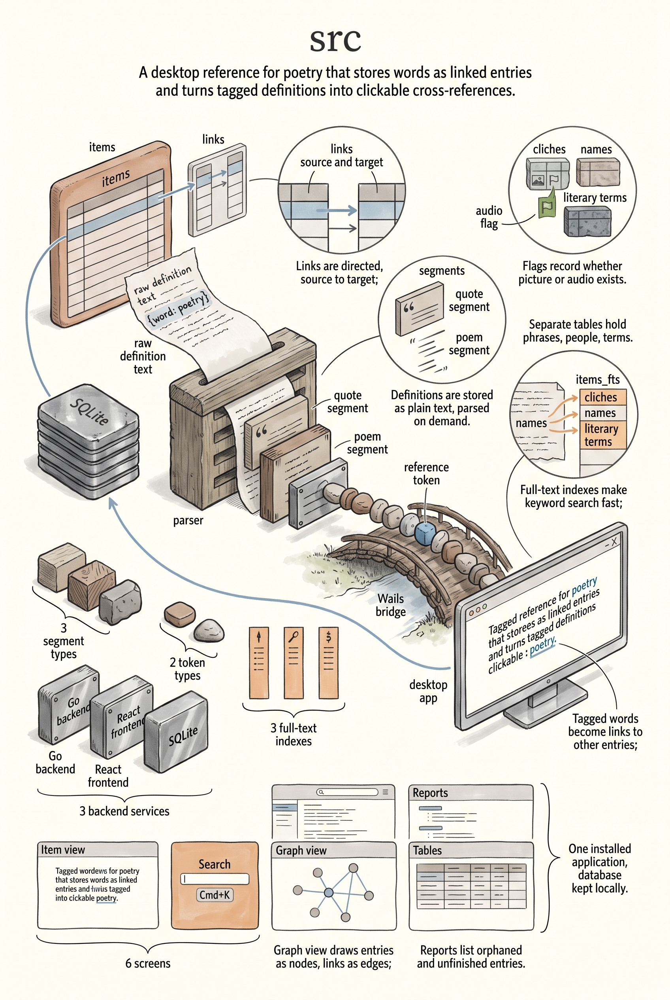

# Poetry Application Documentation

Welcome to the documentation for the Poetry Application. This book details the architecture, data model, and usage of the system.

## Overview

The Poetry Application is a literary reference system designed to manage and explore relationships between words, poems, authors, and literary terms.

## Sections

- **User Guide**: Overview, Getting Started, and Features & Usage.
- **Technical Documentation**: Architecture, Backend Services, and Frontend Application.
- **Data Modeling**: Detailed explanation of the database schema and data structures.

