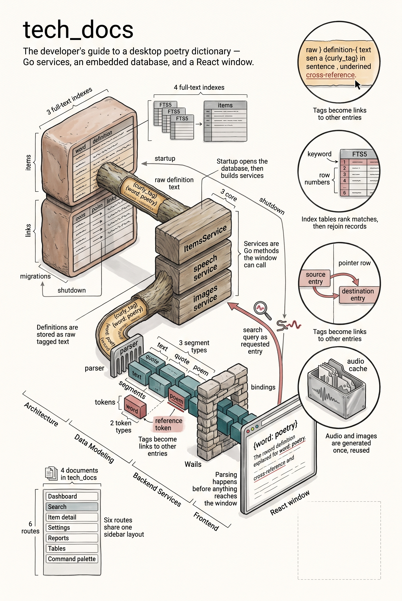

# Technical Documentation

This section is intended for developers contributing to the Poetry Application. It covers the system architecture, backend services, frontend structure, and build processes.

## Table of Contents

- [Architecture Overview](architecture.md)
- [Data Modeling](data_modeling.md)
- [Backend Services](backend.md)
- [Frontend Application](frontend.md)

